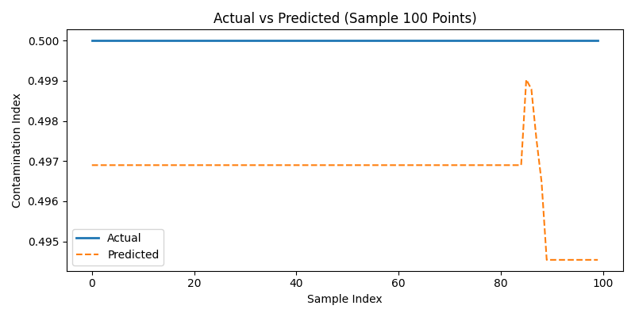

🌿 AquaSentinel
AI-Powered Water Quality & Supply Prediction System

“Because every drop counts — detect, predict, and protect.”

💧 Overview

AquaSentinel is an advanced AI-driven spatio-temporal water monitoring and forecasting system that predicts contamination risk, water quality, and supply health using environmental, industrial, and IoT sensor data.

This project combines deep learning (CNN-LSTM) with a Hybrid ALOA + PSO (Ant Lion + Particle Swarm Optimization) algorithm to optimize model parameters for improved accuracy and adaptability.

It empowers city water boards, environmental researchers, and IoT engineers to proactively identify contamination risks, predict shortages, and visualize water safety in real time.

🧩 Key Features
Module	Description
Data Ingestion	Reads multi-source data (sensors, rainfall, civic reports).
Preprocessing	Handles encoding issues, scaling, and cleaning automatically.
Feature Engineering	Computes Contamination Index (CI) and Supply Health Index (SHI).
Hybrid AI Model	CNN-LSTM hybrid optimized by ALOA + PSO metaheuristics.
Evaluation	Calculates RMSE, R², and visualizes accuracy.
Prediction Engine	Generates CI forecasts and safety classifications (Safe, Moderate, Contaminated).
Visualization Suite	Accuracy graph, heatmap, comparison, scatter, and result summary.
Artifacts & Reports	Saves .h5, .pkl, .yaml, .json, .png outputs.
🧠 Tech Stack
Layer	Tools / Frameworks
Language	Python 3.11
Libraries	TensorFlow / Keras, Scikit-learn, Pandas, NumPy
Optimization	Hybrid ALOA + PSO
Visualization	Matplotlib, Seaborn
Data Handling	chardet (for encoding), YAML, JSON, Pickle
Output Formats	.h5, .pkl, .yaml, .json, .png, .csv
⚙️ Folder Structure
📦 Water Quality & Supply Prediction System/
│
├── archive/
│   └── water_dataX.csv             # Raw dataset
│
├── AquaSentinel_Hybrid_ALOA_PSO.py # Training + Hybrid optimization
├── AquaSentinel_Predictor.py       # Prediction and result generator
│
├── hybrid_AquaSentinel_model.h5    # Trained CNN-LSTM model
├── hybrid_AquaSentinel_scaler.pkl  # Scaler object
├── hybrid_AquaSentinel_config.yaml # Model config
├── hybrid_AquaSentinel_results.json# Performance metrics
│
├── hybrid_AquaSentinel_predictions.csv           # Predicted CI and quality
├── hybrid_AquaSentinel_prediction_graph.png      # Prediction trend
├── hybrid_AquaSentinel_prediction_distribution.png# Histogram
├── hybrid_AquaSentinel_result_graph.png          # RMSE & R²
└── hybrid_AquaSentinel_accuracy_graph.png        # Training vs validation

🚀 How It Works
1️⃣ Data Preparation

Loads water sensor data (pH, turbidity, conductivity, etc.), handles encoding, fills missing values, and scales features.

2️⃣ Feature Engineering

Generates two indices:

Contamination_Index = f(pH, Turbidity, Conductivity, DO)
Supply_Health_Index = f(Pressure, FlowRate, Reservoir_Level)

3️⃣ Model Training

Trains a CNN-LSTM network optimized with Hybrid ALOA + PSO to minimize RMSE and improve generalization.

4️⃣ Evaluation & Visualization

Outputs:

Training vs Validation Loss

Feature Correlation Heatmap

Actual vs Predicted Comparison

Prediction Scatter

RMSE & R² Result Graph

5️⃣ Prediction

Using the saved .h5 model:

Predicts Contamination Index for new sensor readings.

Classifies water zones:

🟢 Safe (CI < 0.3)

🟡 Moderate (0.3 ≤ CI < 0.7)

🔴 Contaminated (CI ≥ 0.7)

Saves predictions to CSV and visualizes results.

📊 Example Prediction Output
Zone	Contamination_Index	Supply_Health_Index	Predicted_Quality
Sector-15	0.87	0.42	🔴 Contaminated
Sector-62	0.41	0.73	🟡 Moderate
Sector-21	0.18	0.94	🟢 Safe

🧮 Model Optimization
Algorithm	Role
ALOA (Ant Lion Optimization)	Performs global exploration to find promising hyperparameter regions.
PSO (Particle Swarm Optimization)	Exploits the search space around ALOA results for local fine-tuning.
CNN-LSTM	Learns both spatial (multi-sensor) and temporal (time-series) patterns.
🖼️ Visualization Outputs
Graph	Description
hybrid_AquaSentinel_accuracy_graph.png	Training vs Validation Loss
hybrid_AquaSentinel_comparison_graph.png	Actual vs Predicted (Sample 100)
hybrid_AquaSentinel_prediction_graph.png	CI prediction over time
hybrid_AquaSentinel_prediction_distribution.png	Histogram of CI predictions
hybrid_AquaSentinel_result_graph.png	RMSE & R² summary bar chart
💾 Outputs Summary
File	Description
.h5	Trained CNN-LSTM model
.pkl	MinMaxScaler object
.yaml	Config & parameters
.json	Metrics & summaries
.csv	Prediction results
.png	Graphs and visualizations
📈 Performance Metrics Example
{
    "RMSE": 0.0412,
    "R2_Score": 0.9481,
    "Optimizer": "Hybrid ALOA + PSO",
    "Best_Params": {
        "filters": 32,
        "lstm_units": 64,
        "dropout": 0.23,
        "lr": 0.001
    },
    "Rows": 1350,
    "Cols": 12
}

🔮 Future Enhancements

Integration with IoT flow meters for real-time water network feedback.

Satellite imagery fusion for river basin contamination mapping.

Streamlit dashboard for interactive live visualization.

Citizen complaint integration (NLP-based sentiment analysis).

Cloud deployment with API endpoints for smart-city systems.

🧰 Requirements

Install dependencies using:

pip install tensorflow scikit-learn pandas numpy seaborn matplotlib pyyaml chardet

🧭 Usage Steps
🏗️ Step 1: Train the Hybrid Model
python AquaSentinel_Hybrid_ALOA_PSO.py

🔮 Step 2: Generate Predictions
python AquaSentinel_Predictor.py

📊 Step 3: View Results

Check your output folder for:

hybrid_AquaSentinel_predictions.csv
hybrid_AquaSentinel_accuracy_graph.png
hybrid_AquaSentinel_result_graph.png
hybrid_AquaSentinel_result_summary.json

📜 License

MIT License © 2025 Sagnik Patra

🌎 Author

Sagnik Patra
AI & Data Science Enthusiast | NIAT & NIU
